# Guide to getting started with CrispGameLib

[cgl-url]: https://github.com/abagames/crisp-game-lib
[aba-url]: https://github.com/abagames
[aba-asa]: http://www.asahi-net.or.jp/~cs8k-cyu/
[cgl-jun]: https://github.com/JunoNgx/crips-game-lib-collection
[crr]: https://junongx.github.io/crips-game-lib-collection/?chargerushre
[cro]: http://abagames.sakura.ne.jp/html5/cr/

Welcome to my tutorial for [CrispGameLib][cgl-url].

As someone who has absolutely been in love with the entirety of [ABAGames][aba-url]' (Kenta Cho) works, I eventually got around to use **CrispGameLib** in July 2021, and had probably one of my best developement experiences ever. It eventually struck me that despite the library's simplicity and low barrier of entry, its popularity has been low, and I and Kenta appeared to be the only creators who used this library.

Here's my attempt to change that. If you are into making videogames and looking for something interesting, I hope I have found you one right here.

# Table of content

- [About CrispGameLib](#about-crispgamelib)
- [The goal](#the-goal)
- [What you need](#what-you-need)
- [How to read this tutorial](#how-to-read-this-tutorial)
- [The tutorial](#the-tutorial)
  - [Step 00: Setting up](#step-00-setting-up)
    - [Step 001: Getting the software](#step-001-getting-the-software)
    - [Step 002: Getting the library](#step-002-getting-the-library)
    - [Step 003: Setup the npm package](#step-003-setup-the-npm-package)
  - [Step 01: Basic drawing and update (stars)](#step-01-basic-drawing-and-update-stars)
    - [Step 011: Renaming title](#step-011-renaming-title)
    - [Step 012: Create the tuning data container and change the size](#step-012-create-the-tuning-data-container-and-change-the-size)
    - [Step 013: Container variable and JSDoc](#step-013-container-variable-and-jsdoc)
    - [Step 014: The initialising block](#step-014-the-initialising-block)
    - [Step 015: The update loop](#step-015-the-update-loop)
  - [Step 02: Input and control (player)](#step-02-input-and-control-player)
    - [Step 021: Another type](#step-021-another-type)
    - [Step 022: Input handling](#step-022-input-handling)
    - [Step 023: Custom sprite](#step-023-custom-sprite)
  - [Step 03: Object control, creation, and removal (fBullets)](#step-03-object-control-creation-and-removal-fbullets)
    - [Step 031: Firing bullets](#step-031-firing-bullets)
    - [Step 032: Object management and removal](#step-032-object-management-and-removal)
    - [Step 033: Dual barrels](#step-033-dual-barrels)
    - [Step 034: Muzzleflash and particles](#step-034-muzzleflash-and-particles)
  - [Step 04: Mechanic control (enemies)](#step-04-mechanic-control-enemies)
    - [Step 041: The formation](#step-041-the-formation)
    - [Step 042: Processing the Enemy](#step-042-processing-the-enemy)
    - [Step 043: Spawning](#step-043-spawning)
  - [Step 05: Collision detection](#step-05-collision-detection)
    - [Step 051: Destroying enemies](#step-051-destroying-enemies)
    - [Step 052: Two-way interaction](#step-052-two-way-interaction)
  - [Step 06: How audio works](#step-06-how-audio-works)
    - [Step 061: The basic way](#step-061-the-basic-way)
    - [Step 062: Infinite sound](#step-062-infinite-sound)
  - [Step 07: More complex movements (eBullets)](#step-07-more-complex-movements-ebullets)
    - [Step 071: Enemy bullets](#step-071-enemy-bullets)
    - [Step 072: Scoring](#step-072-scoring)
  - [Step 08: Extra goodies](#step-08-extra-goodies)
    - [Step 081: Replay](#step-081-replay)
    - [Step 082: Themes](#step-082-themes)
    - [Step 083: GIF capturing](#step-083-gif-capturing)
- [Game Distribution](#game-distribution)
- [Community](#community)
- [Feedback and Critique](#feedback-and-critique)

# About CrispGameLib

[CrispGameLib][cgl-url] is a Javascript game library geared towards making arcade-like mini games for web browsers. I believe it's fair to say that it's the spritual successor to [Mini Game Programming Library](https://github.com/abagames/mgl) and [MGL-coffee](https://github.com/abagames/mgl.coffee), both of which were made by Kenta Cho.

CrispGameLib priotizes simplicity and leanness of the game, taking care of many common elements, allowing the developer to focus on the creating gameplay, prototyping and getting the game to a playable state. Here are some notable facts:

* Games are playable only on web browsers, presented as [HTML5 canvas](https://developer.mozilla.org/en-US/docs/Web/HTML/Element/canvas).
* The gameloop, collision detection, and high scores, are automatically handled under the hood.
* All drawn sprites are limited to squared shapes of a preset of 16 colours.
* Custom sprites are limited to the size of 6x6, represented by characters defined in the array `characters []` (more on this later).
* Audio and music are procedurally generated and limited to a set of 8 sound effects (also, more on this later).
* Control is restricted to one pointer, controlled with mouse or single touch.

Needless to say, like most game engines and libraries out there, CrispGameLib is great for a particular kind of games, and not so great for others. If you are making a massive open world RPG with a lot of fine tuning and complex systems, this is not going to cut it. On the other hand, if you are prototyping an idea for smartphones you have in mind, or just looking for something small you can spend on for less than an afternoon, here's a great choice of tool.

A game speaks a million words, so do check out [Kenta's works][aba-asa] and [mine][cgl-jun] for a good idea of what this library can do.

# The goal

This is a project driven tutorial. We are going to learn gamedev by making a very particular game: [Charge Rush RE][crr], which is my own remake of the mgl.coffee-powered [CHARGE RUSH][cro] by Kenta himself. This is a game I have massively enjoyed for many years over, which also has a great balance of simplicity, complexity, and depth, in from both gameplay and gamedev perspectives. These are great properties for a learning project. The final game does have some small deviations, which you can take a look at [here](https://junongx.github.io/crisp-game-lib-tutorial/?chargerush).

At the end of the tutorial, besides having your own version of Charge Rush running and working, hopefully you'll have a good idea of:
* The code structure and thinking process to create a game with CrispGameLib.
* Using GameCrispLib features, including drawing, resolving collisions, using audio, and managing scores.
* How game data are structured, accessed, and iterated in container arrays, with or without using CrispGameLib built-in functions (`times()` and `remove()`).

Bonus things that would be extremely great if you could get an understanding of:
* How CrispGameLib works under the hood and its quirks.
* How to optimize the collision detection processes.
* The software development practices I discuss and your own opinionated preferences.
* How to make your next game.
* How to use *JSDoc* to benefit a Javascript project.
* How to distribute and deploy a CrispGameLib game on the web via GitHub Page.

# What you need

As much as I would like to make this tutorial as accessible as possible, covering `hello world` is unfortunately out of the scope of this tutorial. You don't need to be a Javascript expert, but it is necessary that you have **an understanding of basic programming** (especially including: the concept of variables, performing operations, conditions, loops, and functions). Basically, if you're relatively fluent in any programming language, you're good to go.

You'll also need a capable device that can operate the **NodeJS** ecosystem and **a web browser that runs HTML5** (probably good as long as it's not Internet Explorer). Technically, you can use any IDE or text editor, but I personally find **VSCode** so well-optimized to this that it's a no-brainer choice.

You also don't need any previous gamedev experience (this is a great choice for your first), though I will occasional make comparisons to other popular game engines to explain GameCrispLib's quirks.

**Git and version control** are not essential for you to benefit from this tutorial, but is highly recommended like any work involving software.

Finally, this tutorial was written on Windows, so don't freak out if things look a bit different on your Mac or Linux devices.

# How to read this tutorial

Just read it like you should read any tutorial: take it slow, make sure you get the part right, and try not to skip.

In the folder `docs` of this repository, you'll find folders named `step_xx`, representing the incomplete versions of the game, corresponding to the steps of this tutorial. You can either access them locally by visiting the corresponding URL from your web browser `http://localhost:4000/?step_xx` after running `light-server`, or visiting the deployment via GitHub Page, listed at the end of each step. This might sound confusing now, but you'll get the idea after setting up at step 0. Use these as references for your progress in case you run into any problem.


Additionally, you'll also run into certain notations where I explain certain aspects of making the game:
* **CrispGameLib quirk**: explanation of the inner workings of the library those are most likely unusual compared to other tools that you have heard of.
* **Javascript feature**: self-explanatorily, this tutorial assumes that are you unfamiliar with Javascript and will briefly explain features or aspects of the language when it's due.
* **Under the hood**: this is where I will explain shorthand commands and how things inner work behind the scene to give you a bit more knowledge. Hopefully, things will look a bit less like magic to you.
* **Further reading**: self-explanatorily, there is only so much I can cover in one single tutorial and some matters are best researched in-depth separately.
* **Alternative implementation**: many problems or outcomes have no one single definite solution. Occasionally, I will provide an alternative implementation that has some sort of merits you can consider which would hopefully reinforce your understanding of the matter.
* **For your experimentation**: this is where I encourage you to mildly deviate from the model code and do something yourself. These are generally harmless or have very little effect on the game, but will reinforce your understanding of how the codebase works.
* **SWE practice**: while it might be strange to see the term software engineering slung around in beginner-level and simplicity-focused tutorial, but as a software developer myself, I advocate for readable and maintainable codebases. While this is somewhat contradictory to the nature and purpose of this library (games made quick and fast), I believe a healthy balance can be achieved. I will suggest some basic rule you should follow to maintain a good codebase in these sections.

Naturally, this tutorial is highly opinionated and based on my personal experiences and understanding. You are highly encouraged to develop your own preferences and stick to them. I also highly welcome feedback and critiques; feel free to contact me in anyway you can regarding those.

# The tutorial

This is where the fun begins and things start happening on your computer.

## Step 00: Setting up

### Step 001: Getting the software

Like any development work, before we even get to do anything at all on the game, some software installation and build environment setup is due. This is done only once on each device system that you work on. These are very ubiquitous software for development devices. Go to each URL, follow the installation prompting, and proceed with default settings should get it done.

* [Git](https://git-scm.com/downloads) (can be omitted, but I strongly recommend you not to)
* [NodeJS](https://nodejs.org/en/download/)
* A terminal of your choice. I personally use [Hyper](https://hyper.is/#installation). You'll also need to enable `bash` [if you're on Windows](https://gist.github.com/coco-napky/404220405435b3d0373e37ec43e54a23).
* A text editor/IDE of your choice. This tutorial assumes you are using [VSCode](https://code.visualstudio.com/).

----
**Further reading**: At some point, you should also register a GitHub account if you have not had one and [setup an SSH authentication](https://docs.github.com/en/github/authenticating-to-github/connecting-to-github-with-ssh), which will be a significant life improvement when you start pushing your code to remote repositories frequently.

----

### Step 002: Getting the library

Once done, get a distributable version of CrispGameLib, and the simplest way to do so is to clone this repository.

Navigate to the directory where you'd like to work on with the terminal (alternatively, use your operating system's file explorer and opens the terminal there) and enter:

```
	git clone git@github.com:JunoNgx/crisp-game-lib-tutorial.git
	cd crisp-game-lib-tutorial
```

The second command will navigate the terminal into the newly cloned repository folder.

----
**Alternatively**: You can just [download this repository directly](https://github.com/JunoNgx/crisp-game-lib-tutorial/archive/refs/heads/master.zip), unzip it, and work from there. Or you can even get it directly from the original repository, after which you should do some cleanup in `docs` because of existing games.

----

### Step 003: Setup the npm package

In case you're not aware, this is an npm package.

----
**Further reading**: [What is npm? A Node Package Manager Tutorial for Beginners](https://www.freecodecamp.org/news/what-is-npm-a-node-package-manager-tutorial-for-beginners/)

----

To get the package setup and working, run `npm install` from the terminal.

In ways you feel comfortable with, go to the folder `docs`, make a copy of `docs/_template` in the same place and rename it to `chargerush`.

Return to your terminal and enter `npm run watch_games`. You should now no longer be able to type into the console (hint: if you'd like to exit, press `CTRL + C`). Meanwhile, open your browser and access the URL `http://localhost:4000/?chargerush`.

----
**Under the hood**: if you look into `package.json`, you will notice that `npm run watch_games` is a shorthand for `"light-server -s docs -w \"docs/**/* # # reload\""`, which initialises `light-server`, which is an npm package that allows you to run a static http server with livereloading (meaning that every time you save, the server will restart and refresh, running your new code immediately. Pretty magic, huh?). You don't need to know everything about `light-server`, but it's useful to understand [what it is](https://www.npmjs.com/package/light-server).

----

If you see a square bright screen against a slightly darker background, with what appears to be score and high score on the top corners, then congratulations, you've done that right 🥂.

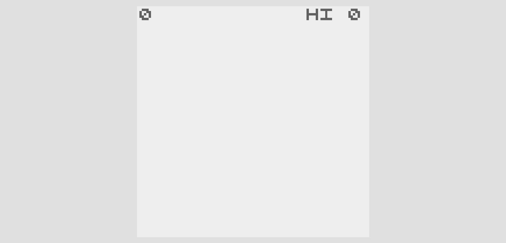

In case you are not getting there yet:
* Check the terminal and make sure that `light-server` is running.
* Check `docs` folder and make sure that the copied template is correctly named.
* Check the browser and make sure that you are accessing the `localhost` URL (not `0.0.0.0`), pointing to the right name of the folder after the question mark.

Once you've got the game running, open VSCode in the root folder of the repository, and open the file `docs/chargerush/main.js`. It's up to your personal preference, but my favourite setup involves halving the screen into VSCode and the browser running the game.

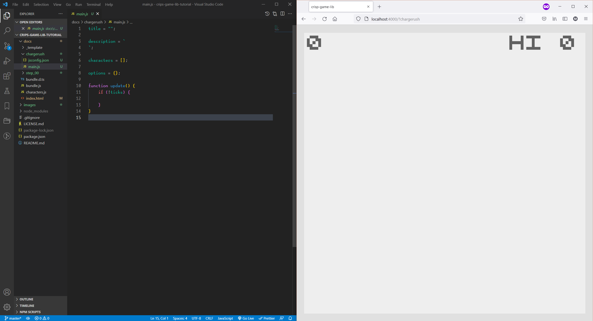

If you ever pause this tutorial to return another time, **don't forget** to run `light-server` again with `npm run watch_games`.

Things will get interesting from here.

----
**Hint**: VSCode also has a built-in terminal. You may either run the server or operate `git` commands from there, saving another terminal window.

----

Step 00 conclusion: [deployment](https://junongx.github.io/crisp-game-lib-tutorial/?step_00) / [code](https://raw.githubusercontent.com/JunoNgx/crisp-game-lib-tutorial/master/docs/step_00/main.js).

## Step 01: Basic drawing and update (stars)

### Step 011: Renaming title

The content of the template `main.js` is relatively lean. Comments have been added in for your information:

```javascript
// The title of the game to be displayed on the title screen
title  =  "";

// The description, which is also displayed on the title screen
description  =  `
`;

// The array of custom sprites
characters  = [];

// Game runtime options
// Refer to the official documentation for all available options
options  = {};

// The game loop function
function  update() {
	// The init function
	if (!ticks) {

	}
}
```
----
**SWE practice**: Do be very mindful of indentations. Incorrect indentations make the codes hard to read, on top of causing complications in diffs in version control. This template and tutorial are set to indentation of 4 whitespaces. **Further reading**: [Indentation Style](https://en.wikipedia.org/wiki/Indentation_style).

----

Let's do the minimally important thing: changing the game name. Edit the first line:

```javascript
title = "CHARGE RUSH";
```

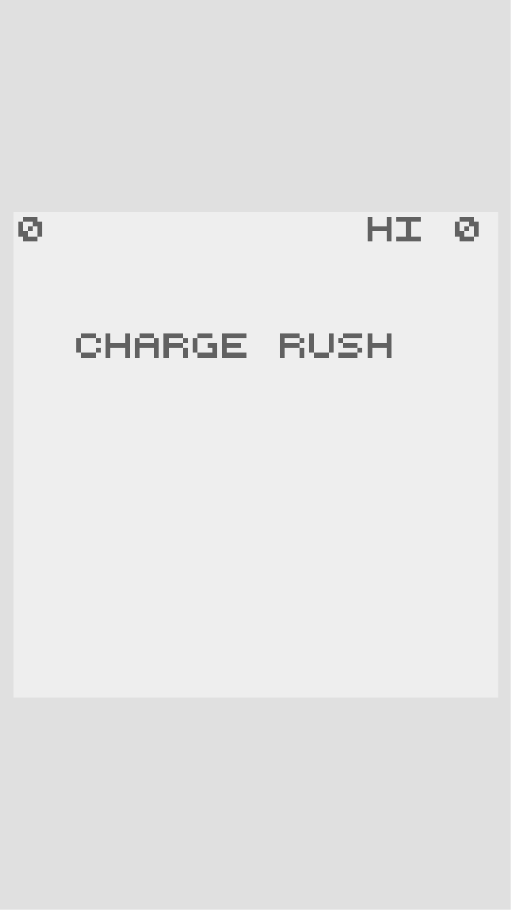

As soon as you save the file, the server should automatically reload and the browser should now shows the game with its title `CHARGE RUSH`. Feeling excited yet?

### Step 012: Create the tuning data container and change the size

Next, we will create a Javascript object which will hold a lot of the game's important data. Add this block just above the `options`.

```javascript
const G = {
	WIDTH: 100,
	HEIGHT: 150
};
```
----
**SWE practice**: this object is declared as a `const` (for constant), which means its value is read-only once the game is started. Constant values should be capitalised in `CAPITALISED_SNAKE_CASE`, as these are essential values we will refer to over and over again throughout the codebase (this is premature, but you will soon see this enough, and also in contrast to local temporary `const` variables which I will use later on). **Further reading**: [When to capitalize your JavaScript constants](https://www.freecodecamp.org/news/when-to-capitalize-your-javascript-constants-4fabc0a4a4c4/).

----

We now may use these values to change the size of the game:

```javascript
options = {
	viewSize: {x: G.WIDTH, y: G.HEIGHT}
};
```

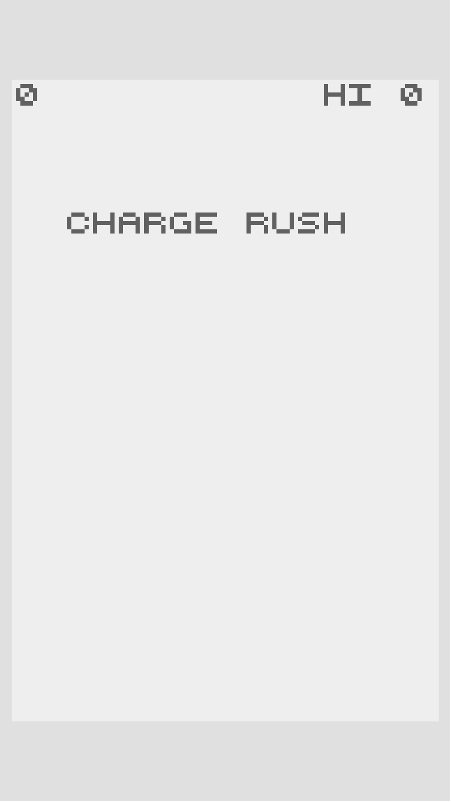

While it is possible to simply just declare this as `options = {viewSize: {x: 100, y: 150}};`, putting this behind one single constant variables will simplify the game tuning process significantly. If you change your mind and want the game to be square again, `G.HEIGHT` is the only one place to edit, instead of running after every single instances of the value `150`.

We will also explore other properties of `options` along the way. Don't be surprised if you occasionally see strange properties enabled in the step references.

### Step 013: Container variable and JSDoc

Next, we will make something simple, but satisfying and motivating: the stars. Add the following block below `options`:

```javascript
/**
* @typedef {{
* pos: Vector,
* speed: number
* }} Star
*/

/**
* @type  { Star [] }
*/
let stars;
```

If you think those blocks are weird, you are correct that they are not very common sights. Also, the following section is going to be slightly heavy.

You probably have heard of this very hot thing called **TypeScript** in web development. They fix a major problem in Javascript, which is in its name itself: **typing**. By pre-defining sets of object properties as types, it is much easier to debug and get a program to work as intended. We are definitely not writing TypeScript, but **JSDoc** provides us with a very similar advantage.

While the two blocks of comments above do absolutely nothing while the game is running, they help you in getting the game to run correctly. Here the type `Star` is defined as object with two property: `pos` of type `Vector` (which is defined by CrispGameLib) and `speed` of type `number`. Let's say for some reason, you make a mistake and assigned a `string` value to `star.speed` like `star1.speed = "tsk tsk"`, VSCode will highlight this mistake and yell at you, preventing you from running that mistake and wasting your time and effort on needless debugging.

Similarly, `stars` is declared as an array of objects of type `Star`.

You can even write this in a more verbose and descriptive manner if you choose to:

```javascript
/**
* @typedef { object } Star - A decorative floating object in the background
* @property { Vector } pos - The current position of the object
* @property { number } speed - The downwards floating speed of this object
*/
```
If these feel weird, simply think of them as **class declaration**, a very common concept in programming. You probably will find them a hassle at first, but as far as my experience go, this is probably the most life-changing and quality-of-life improving thing I have found while writing Javascript.

If you personally find them unnecessary, it is understandable and the opinion has merit in the context of these small games. Feel free to omit them from your codes and proceed, though I personally don't recommend it unless you know very well what you are doing.

**Further reading**: [JSDoc](https://www.typescriptlang.org/docs/handbook/jsdoc-supported-types.html).

### Step 014: The initialising block

----
**Under the hood**: Like most game engines, CrispGameLib has an `update()` loop, running 60 times per second. The framerate is fixed and not changeable. This also mean that games made with CrispGameLib are entirely frame-rate dependent, omitting the need to handle `deltaTime` and instead, working with number of frames directly (if you have ever used Pico-8, you'd get the idea). You also get access to `ticks`, which provides you with the number of frames the game has passed.

----

In `update()`, you will see a block of `if (!ticks) {}` already written. In a nutshell, this is the equivalent to `init()`, the function that will run at the start of the game.

Here, we'd like to initialise the variable `stars` we declared:
```javascript
// The game loop function
function update() {
    // The init function running at startup
	if (!ticks) {
        // A CrispGameLib function
        // First argument (number): number of times to run the second argument
        // Second argument (function): a function that returns an object. This
        // object is then added to an array. This array will eventually be
        // returned as output of the times() function.
		stars = times(20, () => {
            // Random number generator function
            // rnd( min, max )
            const posX = rnd(0, G.WIDTH);
            const posY = rnd(0, G.HEIGHT);
            // An object of type Star with appropriate properties
            return {
	            // Creates a Vector
                pos: vec(posX, posY),
                // More RNG
                speed: rnd(0.5, 1.0)
            };
        });
	}
}
```

There is quite a lot to be unpacked here, so take it slow. There are four things to take note of:
* The function `vec(x, y)` to create a `Vector` object. This is defined by CrispGameLib.
* The random number generator `rnd (min, max)` (you should also be aware of its variant that returns a rounded integer `rndi (min, max)`). Here it is used to generate a random position within the screen.
* I declared the temporary variables `posX` and `posY` as `const`, but did not capitalise them, because they are [scoped local variables](https://www.w3schools.com/js/js_scope.asp), in constrast to the global constant variable `G`.
* The CrispGameLib built-in function `times( number, func())`. This might sound a bit confusing, but it is actually just a short hand for a `for loop`. **Alternatively**, the block can practically be re-written as:
```javascript
function update() {
    if (!ticks) {
        for (let i = 0; i < 20; i++) {
            stars.push({
                pos: vec(rnd(0, G.WIDTH), rnd(0, G.HEIGHT)),
                speed: rnd(0.5, 1.0)
            });
        }
    }
}
```

Also, this is also a chance for a refactor and add more game design variables to `G`. We'd be doing this a lot from now on, so keep track of your object `G`:
```javascript
const G = {
	STAR_SPEED_MIN: 0.5,
	STAR_SPEED_MAX: 1.0
}
```
```javascript
	return {
	    pos: vec(posX, posY),
	    speed: rnd(G.STAR_SPEED_MIN, G.STAR_SPEED_MAX)
	};
```

However, this has no visible effect on the game yet.

### Step 015: The update loop

We'll now be drawing the stars on screen. Add this block inside the `update()` block, just below the `if (!ticks) {}`:

```javascript
    // Update for Star
    stars.forEach((s) => {
        // Move the star downwards
        s.pos.y += s.speed;
        // Bring the star back to top once it's past the bottom of the screen
        s.pos.wrap(0, G.WIDTH, 0, G.HEIGHT);

        // Choose a color to draw
        color("light_black");
        // Draw the star as a square of size 1
        box(s.pos, 1);
    });
```

This block should look a lot less foreign, if you have ever seen videogame codes:
* The method `Array.forEach()` iterates and execute on each element in the array. In this case, each `star` is updated 60 times a second. **Further reading**: [MDN documentation](https://developer.mozilla.org/en-US/docs/Web/JavaScript/Reference/Global_Objects/Array/forEach).
* `s.pos.y += s.speed` adds the y coordinate of the star by `speed` (which we randomly generated when we created the stars), bringing the star perpetually downwards to the bottom of the screen (unlike conventional high school math, the y-axis points downwards).
* `wrap(minX, maxX, minY, maxY)` is a method for `Vector`, which wrap the object back to the otherside, when the object is outside of the screen (which is specified by the screen coordinates as the four arguments). The handling of the x coordinate here is redundant as it never changes. **Alternatively,** this can be re-written more effectively as `if (s.pos.y > G.HEIGHT) s.pos.y = 0;`
* The color is set before the star is drawn with `color()` (`light_black` sounds a bit wacky, but it does make sense when you look at the list of colors). Here, the `box()` is chosen to represent the star, taking the star's coordinate as an argument. **Further reading**: [the drawing example demo in CrispGameLib](https://abagames.github.io/crisp-game-lib-games/?ref_drawing). Take note of the alternative use of `x` and `y` arguments as coordinates in opposed to a `Vector`.

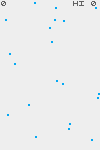

Pretty cool, yeah?

----
**For your experimentation**: Try changing:
* The value of `G.STAR_SPEED_MIN` and `G.STAR_SPEED_MAX` and see how things change. Feel free to stay on a different set of values.
* The color of the stars (the list of colors can again be found in the [documentation][cgl-url]).
* The size of the star as the second argument of `box()`.

----

Step 01 conclusion: [deployment](https://junongx.github.io/crisp-game-lib-tutorial/?step_01) / [code](https://raw.githubusercontent.com/JunoNgx/crisp-game-lib-tutorial/master/docs/step_01/main.js).

## Step 02: Input and control (player)

Here we will start handling the player entity.

### Step 021: Another type

First, let's get started with more type and variable declaring. This is not unlike what we did previously:
```javascript
/**
 * @typedef {{
 * pos: Vector,
 * }} Player
 */

/**
 * @type { Player }
 */
let player;
```
Unlike `stars`, `player` is in singular form, holding a single object instance of type `Player`. If you are feeling confused, do check out step 013 again.

We can also initialise the `player` object in the initialisation block (this is right below `stars`):
```javascript
player = {
    pos: vec(G.WIDTH * 0.5, G.HEIGHT * 0.5)
};
```
Do take note of the use of game size variables `G.WIDTH` and `G.HEIGHT`, divided by half, to access the mid-position of the screen. We can now also start drawing the player:

```javascript
    color("cyan");
    box(player.pos, 4);
```

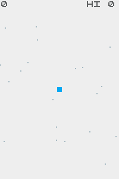

### Step 022: Input handling

This is, however, still not interactive. We will fix this by handling `input`. By conventional standard, an entity's updates occur before drawing, so put this line before the drawing codes above.

```javascript
    player.pos = vec(input.pos.x, input.pos.y);
```

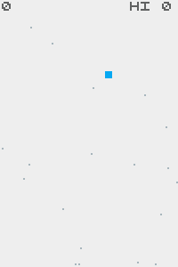

Nice. The player now follows your mouse pointer.

----
**Further reading**: [The input example from the documention](https://abagames.github.io/crisp-game-lib-games/?ref_input). Besides the coordinate of the pointer, you also get access to three booleans `isPressed`, `isJustPressed`, `isJustReleased`, representing the three states of the button. While these will not be used in this tutorial, they are important. You can also do interesting and complicated input techniques with this, such as double tap/click, long press, or swiping.

----

However, we have one problem: the player occasionally moves out of the game screen, which is not ideal. We need to keep the player strictly within the screen at all times:

```javascript
    player.pos.clamp(0, G.WIDTH, 0, G.HEIGHT);
```

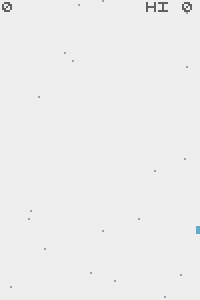

You will notice that the interface and signature of `Vector.clamp(minX, maxX, minY, maxY)` is very similar to `wrap()`, though it does something else.

### Step 023: Custom sprite

A square, however, is not very appealing or interesting. This is where I show you how to use custom sprite characters.

Just below the `description` declaration, notice that there is an empty array `character = [];`. Time to use it. Try populate it with something. Do note the use of backticks for **template literal** and how there was no indentation. VSCode is going to automatically insert indentations among other things, so make sure you paste in correctly and manually fix any incorrect whitespaces:

```javascript
characters = [
`
  ll
  ll
ccllcc
ccllcc
ccllcc
cc  cc
`
];
```

Now, replace the drawing line with another function to use this character:
```javascript
    color("cyan");
    // box(player.pos, 4);
    char("a", player.pos);
```

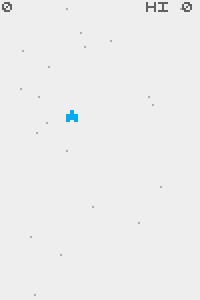

Notice that the shape has been changed to the new array element we have just populated with, though the color remains the same. Now try something else by changing the color to `black`:

```javascript
    // color("cyan");
    color ("black");
    // box(player.pos, 4);
    char("a", player.pos);
```

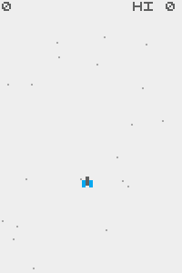

Interesting, eh?

In order to explain this weird phenomenon you've just witnessed, I need to show you an excerpt of the documentation, regarding the color list:

```javascript
// Define pixel arts of characters.
// Each letter represents a pixel color.
// (l: black, r: red, g: green, b: blue
//  y: yellow, p: purple, c: cyan
//  L: light_black, R: light_red, G: light_green, B: light_blue
//  Y: light_yellow, P: light_purple, C: light_cyan)
// Characters are assigned from 'a'.
// 'char("a", 0, 0);' draws the character
// defined by the first element of the array.
```
And look at this again:

```javascript
characters = [
`
  ll
  ll
ccllcc
ccllcc
ccllcc
cc  cc
`
];
```

Notice that the `l` and `c` are actually short forms of the color `black` and `cyan`. By changing these characters to other valid characters that also represent colors, you would change the color of some pixels in this sprite. The excerpt also explains the function `char()`, in which `a` is represented by the first element in the array `characters`. Also, by setting the drawing color to `color("black")`, the engine will draw the sprite with the originally colors, instead of an overlay.

----
**For your experimentation**: Using the available colors, make your own sprite that represents the player's ship by modifying the first element in `characters`. Do notice that you are limited only to the size 6x6.


**CrispGameLib quirk**: At this point, you should also notice that the sprite is drawn at the middle of your cursor position. This is a slightly deviation from the norm in other game engine, in which the drawing origin is usually at the top left corner. In CrispGameLib, the drawing origin is in the middle.

----

Step 02 conclusion: [deployment](https://junongx.github.io/crisp-game-lib-tutorial/?step_02) / [code](https://raw.githubusercontent.com/JunoNgx/crisp-game-lib-tutorial/master/docs/step_02/main.js).

## Step 03: Object control, creation, and removal (fBullets)

We are finally going to fire our gun!
### Step 031: Firing bullets

First thing first, more stuff to declare. You should be quite familiar with this by now:

```javascript
const G = {
	WIDTH: 100,
	HEIGHT: 150,

    STAR_SPEED_MIN: 0.5,
	STAR_SPEED_MAX: 1.0,

    PLAYER_FIRE_RATE: 4,
    PLAYER_GUN_OFFSET: 3,

    FBULLET_SPEED: 5
};
```

```javascript
/**
 * @typedef {{
 * pos: Vector,
 * firingCooldown: number,
 * isFiringLeft: boolean
 * }} Player
 */

/**
 * @type { Player }
 */
let player;

/**
 * @typedef {{
 * pos: Vector
 * }} FBullet
 */

/**
 * @type { FBullet [] }
 */
let fBullets;
```

Do take note of the new properties added type `Player`: `firingCooldown` and `isFiringLeft`. If you have done your JSDoc properly, you would also notice that VSCode will start yelling at you, telling you that the `player` instance you initialised is incorrect and missing some properties (which is exactly what we expected). Other than fixing this, you should also start initalise `fBullets`, which is a short form of *friendly bullets*, to differentiate against *enemy bullets* we'd have later on.

```javascript
        player = {
            pos: vec(G.WIDTH * 0.5, G.HEIGHT * 0.5),
            firingCooldown: G.PLAYER_FIRE_RATE,
            isFiringLeft: true
        };

        fBullets = [];
```

Next up, we update them:
```javascript
    // Updating and drawing the player
    player.pos = vec(input.pos.x, input.pos.y);
    player.pos.clamp(0, G.WIDTH, 0, G.HEIGHT);
    // Cooling down for the next shot
    player.firingCooldown--;
    // Time to fire the next shot
    if (player.firingCooldown <= 0) {
        // Create the bullet
        fBullets.push({
            pos: vec(player.pos.x, player.pos.y)
        });
        // Reset the firing cooldown
        player.firingCooldown = G.PLAYER_FIRE_RATE;
    }
    color ("black");
    char("a", player.pos);

    // Updating and drawing bullets
    fBullets.forEach((fb) => {
        // Move the bullets upwards
        fb.pos.y -= G.FBULLET_SPEED;
        
        // Drawing
        color("yellow");
        box(fb.pos, 2);
    });
```


If you have played videogames before, you probably have heard of the concept "cooldown", with which, you'd need to wait for an interval time before you can use a powerful ability again. Though a machine gun is much faster, concept is similar, with a much shorter cooldown time, giving the feeling of bullets being constantly fired. 

Here, the cooldown is set `firingCooldown: G.PLAYER_FIRE_RATE` in the initialisation; and in the update loop, it is perpetually reduced `player.firingCooldown--;` (this is a shorthard for `player.firingCooldown = player.firingCooldown - 1;` in case you are unfamiliar). By the time the cooldown is completed `(player.firingCooldown <= 0)`, a bullet is created, it is set back to the intial value of `G.PLAYER_FIRE_RATE`, and the process repeats. At the fire rate of `5` (frames), the ship is now firing 12 rounds per second.

In the next block, `fBullets` iterates over its elements and perform the update and drawing on each of them not unlike `stars`.

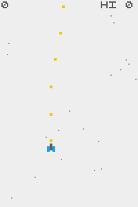

### Step 032: Object management and removal

If you let the game run in the current state for a while, you will notice that it eventually slows down. This is because it is performing updates on hundreds, if not thousands of instances of bullets, which has gone out of screen and is heading towards infinity upwards. Try adding this, which will display the number of bullets existing in the game world:

```javascript
    text(fBullets.length.toString(), 3, 10);
```

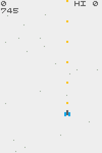

This is quite horrendous. Of course those bullets are no longer relevant and we have to do something about them.

```javascript
    remove(fBullets, (fb) => {
        return fb.pos.y < 0;
    });
```

This is another weird looking function unique to CrispGameLib. Like `forEach()`, it iterates over elements in array, but then, it also checks for conditions to remove them from the container. Think of it as a more intuitive and reversed version of the Javascript's native `Array.filter()`. It directly works on the array in the first parameters, and the elements that yield a `return true` in the second parameter (a function) are removed.

In this case, a bullet out of screen is an irrelevant bullet, hence `fb.pos.y < 0`. Since our bullets only move in one direction, there is only one landmark to check against (the top of the screen). You can also use this function to update a group of objects, which I will show you later.

But for now, the important thing is, there is only a few bullets on screen at a time, and the game is now much more resource-efficient.

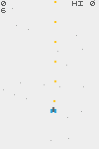

### Step 033: Dual barrels

If you have played the original game, you'd notice that this is not quite accurate, the ship is supposed to have two barrels, and bullets come out of them alternatively. We have actually already taken care part of that with `G.PLAYER_GUN_OFFSET` and `Player.isFiringLeft`. Now let's change the firing process:

```javascript
    if (player.firingCooldown <= 0) {
        // Get the side from which the bullet is fired
        const offset = (player.isFiringLeft)
            ? -G.PLAYER_GUN_OFFSET
            : G.PLAYER_GUN_OFFSET;
        // Create the bullet
        fBullets.push({
            pos: vec(player.pos.x + offset, player.pos.y)
        });
        // Reset the firing cooldown
        player.firingCooldown = G.PLAYER_FIRE_RATE;
        // Switch the side of the firing gun by flipping the boolean value
        player.isFiringLeft = !player.isFiringLeft;
    }
```

----
**Javascript feature** and **further reading**: [Conditional (ternary) operator](https://developer.mozilla.org/en-US/docs/Web/JavaScript/Reference/Operators/Conditional_Operator). The line `const offset = (player.isFiringLeft) ? -G.PLAYER_GUN_OFFSET : G.PLAYER_GUN_OFFSET;` is the short form of a conditional check:
```javascript
    let offset;
    if (player.isFiringLeft) {
        offset = -G.PLAYER_GUN_OFFSET;
    } else {
        offset = G.PLAYER_GUN_OFFSET;
    }
```
Do get yourself familiar with it, this is a very useful shorthand.

----

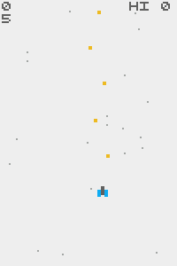

You may also now comment out the number of bullets lines.

### Step 034: Muzzleflash and particles

There is, however, one more thing I'd like to go over before before we're done with firing guns: we're going to put in some exiciting muzzleflash, which we will use **particles** to represent.

```javascript
    if (player.firingCooldown <= 0) {
        // Get the side from which the bullet is fired
        const offset = (player.isFiringLeft)
            ? -G.PLAYER_GUN_OFFSET
            : G.PLAYER_GUN_OFFSET;
        // Create the bullet
        fBullets.push({
            pos: vec(player.pos.x + offset, player.pos.y)
        });
        // Reset the firing cooldown
        player.firingCooldown = G.PLAYER_FIRE_RATE;
        // Switch the side of the firing gun by flipping the boolean value
        player.isFiringLeft = !player.isFiringLeft;

        color("yellow");
        // Generate particles
        particle(
            player.pos.x + offset, // x coordinate
            player.pos.y, // y coordinate
            4, // The number of particles
            1, // The speed of the particles
            -PI/2, // The emitting angle
            PI/4  // The emitting width
        );
    }
```

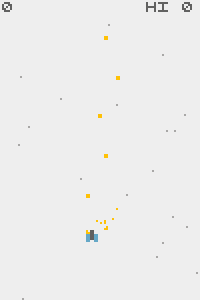

**Further reading**: In order to best understand, here's a relevant excerpt from GameCrispLib documentation:

```javascript
function particle(
  x: number,
  y: number,
  count?: number,
  speed?: number,
  angle?: number,
  angleWidth?: number
);
function particle(
  pos: VectorLike,
  count?: number,
  speed?: number,
  angle?: number,
  angleWidth?: number
);
```
Do take note of my use of `PI` to achieve a 90 degree angle, and the alternative use of `Vector` instead of separated `x` and `y` coordinates, a frequent recurring motif in GameCrispLib API.

Step 03 conclusion: [deployment](https://junongx.github.io/crisp-game-lib-tutorial/?step_03) / [code](https://raw.githubusercontent.com/JunoNgx/crisp-game-lib-tutorial/master/docs/step_03/main.js).

## Step 04: Mechanic control (enemies)

Let's get some enemies in.

### Step 041: The formation

Before we start doing anything, we need to take a look at what we're going to do. [Here's the original game again][cro], if you need a refresher.

While it's not exactly obvious, but the enemies are spawned in a very particular way:
* Enemies are evenly spreaded vertically.
* Enemies' horizontal positions are randomized.
* All enemies in the same wave have the same speed.
* Enemies' score value is increased by 10 per wave.

(And one reason I am certain about all of that, is because I looked at the [source code](http://abagames.sakura.ne.jp/html5/cr/main.coffee) 😎).

### Step 042: Processing the Enemy

To proceed, let's declare some types:

```javascript
/**
 * @typedef {{
 * pos: Vector
 * }} Enemy
 */

/**
 * @type { Enemy [] }
 */
let enemies;

/**
 * @type { number }
 */
let currentEnemySpeed;

/**
 * @type { number }
 */
let waveCount;
```

Type `Enemy` apparently should have their own independent position. However, you'd notice that I have a separate variable `currentEnemySpeed`, which is because enemies that appear onscreen at the same time all have the same speed, so it would be slightly unoptimal to store the same value multiple times. In the grand scheme of the processing resources available, the cost of these variables are tiny, but this is to give you an idea and a taste of optimisation.

To proceed, let's get out the rest of what we need:

```javascript

// New sprite
characters = [
`
  ll
  ll
ccllcc
ccllcc
ccllcc
cc  cc
`,`
rr  rr
rrrrrr
rrpprr
rrrrrr
  rr
  rr
`,
];

// New game design variables
const G = {
    ENEMY_MIN_BASE_SPEED: 1.0,
    ENEMY_MAX_BASE_SPEED: 2.0
};

    // Initalise the values:
    enemies = [];

    waveCount = 0;
    currentEnemySpeed = 0;

    // Another update loop
    // This time, with remove()
    remove(enemies, (e) => {
        e.pos.y += currentEnemySpeed;
        color("black");
        char("b", e.pos);

        return (e.pos.y > G.HEIGHT);
    });
```

However, we are not seeing anything because we haven't spawned them.

### Step 043: Spawning

We'd spawn them the simple way: as long as there is no enemy around. Add this block before processing the `stars` and right after the initialisation:

```javascript
    if (enemies.length === 0) {
        currentEnemySpeed =
            rnd(G.ENEMY_MIN_BASE_SPEED, G.ENEMY_MAX_BASE_SPEED) * difficulty;
        for (let i = 0; i < 9; i++) {
            const posX = rnd(0, G.WIDTH);
            const posY = -rnd(i * G.HEIGHT * 0.1);
            enemies.push({ pos: vec(posX, posY) })
        }
    }
```

Things to note:
* **CrispGameLib feature**: there is a built-in variable called `difficulty`, which starts from `1`, and is progressively increased by `1` for every minute passed, slowly and gradually. If you'd like to see this for yourself, try printing this either onscreen (`text(difficulty.toString(), 3, 10);`) or to the web browser console  (`console.log(difficulty);`). This variable here is used to modify the enemy speed, which will make the game more difficulty as time passes and the value of `difficulty` increases.
* I'm not using `times()` here because we need to access the looping variable `i`, hence this is an old-fashioned standard `for loop`.

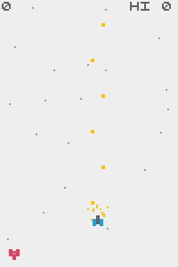

The game now looks much more complete.

Step 04 conclusion: [deployment](https://junongx.github.io/crisp-game-lib-tutorial/?step_04) / [code](https://raw.githubusercontent.com/JunoNgx/crisp-game-lib-tutorial/master/docs/step_04/main.js).

## Step 05: Collision detection

In CrispGameLib, objects' graphic also serve as their hitbox. Everytime a sprite is drawn, regardless with `char()`, `box()`, or `text()`, each and everyone of them is keeping track of which other sprites it is colliding with in the property `isColliding`. **Further reading**: [Collision example demo](https://abagames.github.io/crisp-game-lib-games/?ref_collision). For this reason, strategic thinking about collision should always be planned, such as objects of different types, should have at least different types and different colors, if  their collision is to have an effect on the game.

### Step 051: Destroying enemies

Now, let us make enemies destroyable by friendly bullets:
```javascript
    remove(enemies, (e) => {
        e.pos.y += currentEnemySpeed;
        color("black");
        // Shorthand to check for collision against another specific type
        // Also draw the sprite
        const isCollidingWithFBullets = char("b", e.pos).isColliding.rect.yellow;

        // Check whether to make a small particle explosin at the position
        if (isCollidingWithFBullets) {
            color("yellow");
            particle(e.pos);
        }

        // Also another condition to remove the object
        return (isCollidingWithFBullets || e.pos.y > G.HEIGHT);
    });
```

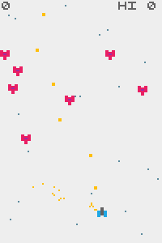

Here, the `boolean` variable `isCollidingWithFBullets` is used as a shorthand referral to check whether a sprite character of type `b` is colliding with any of the yellow rectangles (which are representing a friendly bullet). This initialisation also causes the `char` `b` to be drawn onscreen, even when it's not explicitly used for such purpose. `isCollidingWithFBullets` is then used to check whether there should be a small *particle* explosion at the location of the `Enemy` object, and whether this `Enemy` object should be removed from the container.

### Step 052: Two-way interaction

While we have implemented a simple of form collision detection, having a two-way collision, in which both the bullet and the target are destroyed, is a slightly more complicated matter.

Let us try:

```javascript
    remove(fBullets, (fb) => {
        const isCollidingWithEnemies = box(fb.pos, 2).isColliding.char.b;
        return (isCollidingWithEnemies || fb.pos.y < 0);
    });
```

While this syntatically and logically correct, you will notice this does not work. The enemies are destroyed, but not friendly bullets. The question is why?

Consider this: everything we have written happened in one single frame, which occurs 60 times in a second. By examining the location of `remove(fBullets, (fb) => {});` in the chronological sequence of an `update()`, you will noticed that when a `fBullet` attempts to detect another `char.b`, no `char.b` has yet been drawn in that frame.

The solution: let `fBullets` react to a collision only after `Enemies` have been drawn:

```javascript
    // Updating and drawing bullets
    fBullets.forEach((fb) => {
        fb.pos.y -= G.FBULLET_SPEED;

        // Drawing fBullets for the first time, allowing interaction from enemies
        color("yellow");
        box(fb.pos, 2);
    });

    remove(enemies, (e) => {
        e.pos.y += currentEnemySpeed;
        color("black");
        // Interaction from enemies to fBullets
        // Shorthand to check for collision against another specific type
        // Also draw the sprits
        const isCollidingWithFBullets = char("b", e.pos).isColliding.rect.yellow;
        
        if (isCollidingWithFBullets) {
            color("yellow");
            particle(e.pos);
        }
        
        // Also another condition to remove the object
        return (isCollidingWithFBullets || e.pos.y > G.HEIGHT);
    });

    remove(fBullets, (fb) => {
        // Interaction from fBullets to enemies, after enemies have been drawn
        color("yellow");
        const isCollidingWithEnemies = box(fb.pos, 2).isColliding.char.b;
        return (isCollidingWithEnemies || fb.pos.y < 0);
    });

```

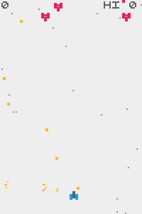

You will also notice that `fBullets` are drawn twice: the first time to allow themselves to be interacted with from `enemies`, and the second time, to interact with `enemies` from themselves.

This is a **CrispGameLib quirk**, while this does sound mind-boggling at first, it is not as complicated as it looks. The takeaway is: always make sure that the two colliding sprites are already drawn, which means occasionally drawing some of them more than once.

Step 05 conclusion: [deployment](https://junongx.github.io/crisp-game-lib-tutorial/?step_05) / [code](https://raw.githubusercontent.com/JunoNgx/crisp-game-lib-tutorial/master/docs/step_05/main.js).
## Step 06: How audio works

### Step 061: The basic way

And here's my favourite part of CrispGameLib. Let me just straight away show you an excerpt of the documentation ([not forgetting an example demo](https://abagames.github.io/crisp-game-lib-games/?ref_sound)):
```javascript
function update() {
  // Plays a sound effect.
  // play(type: "coin" | "laser" | "explosion" | "powerUp" |
  // "hit" | "jump" | "select" | "lucky");
  play("coin");
}
```
It certainly doesn't look difficult. Let's add our own explosion sound:

```javascript
    remove(enemies, (e) => {
        e.pos.y += currentEnemySpeed;
        color("black");
        const isCollidingWithFBullets = char("b", e.pos).isColliding.rect.yellow;
        
        if (isCollidingWithFBullets) {
            color("yellow");
            particle(e.pos);
            play("explosion"); // Here!
        }

        return (isCollidingWithFBullets || e.pos.y > G.HEIGHT);
    });
```

This is not something I can show you in gif, but if you did it right, you're having an explosion for every destroyed enemy.
### Step 062: Infinite sound

It gets even better. Let's add this to `options`.

```javascript
options = {
    seed: 2
}
```

It might not be obvious. But you are listening to a different explosion sound.

To make it even more obvious, add `isPlayingBgm` to enable music:

```javascript
options = {
    seed: 2,
    isPlayingBgm: true
}
```

It gets even crazier; let's add a game description:
```javascript
description = `
Destroy enemies.
`;
```

The bottom line is, CrispGameLib uses a combination of your assigned random `seed` and the content of your `description` to generate a particular sets of audio for your game. This means you are putting in minimum work while still achieving a relatively unique audio experience for each of your games.

Of course, without saying, it comes with a major downside. It means that you have pretty much almost no control at all over audio, and if you are looking to fine tune every single piece of audio, CrispGameLib can't give you that without some major modification to the engine.

Step 06 conclusion: [deployment](https://junongx.github.io/crisp-game-lib-tutorial/?step_06) / [code](https://raw.githubusercontent.com/JunoNgx/crisp-game-lib-tutorial/master/docs/step_06/main.js).

## Step 07: More complex movements (eBullets)

The game is finally taking shape. We are just a few steps away from completing this.

### Step 071: Enemy bullets

We are now adding the final object type: enemy bullets, which means more type declaration and adding more properties to existing types.

```javascript
// New property: firingCooldown
/**
 * @typedef {{
 * pos: Vector,
 * firingCooldown:
 * }} Enemy
 */

// New type
/**
 * @typedef {{
 * pos: Vector,
 * angle: number,
 * rotation: number
 * }} EBullet
 */

/**
 * @type { EBullet [] }
 */
let eBullets;

```

More sprites:
```javascript
characters = [
`
  ll
  ll
ccllcc
ccllcc
ccllcc
cc  cc
`,`
rr  rr
rrrrrr
rrpprr
rrrrrr
  rr
  rr
`,`
y  y
yyyyyy
 y  y
yyyyyy
 y  y
`
];
```

More gameplay variables:
```javascript
const G = {
	WIDTH: 100,
	HEIGHT: 150,

    STAR_SPEED_MIN: 0.5,
	STAR_SPEED_MAX: 1.0,
    
    PLAYER_FIRE_RATE: 4,
    PLAYER_GUN_OFFSET: 3,

    FBULLET_SPEED: 5,

    ENEMY_MIN_BASE_SPEED: 1.0,
    ENEMY_MAX_BASE_SPEED: 2.0,
    ENEMY_FIRE_RATE: 45,

    EBULLET_SPEED: 2.0,
    EBULLET_ROTATION_SPD: 0.1
};
```

Don't forget the initialise and fix whatever VSCode is yelling at you, too.

The attacking mechanism of `enemies` isn't unlike `player`'s, as `firingCooldown` decreases towards zero, fires a bullet, and resets again:

```javascript
    remove(enemies, (e) => {
        e.pos.y += currentEnemySpeed;
        e.firingCooldown--;
        if (e.firingCooldown <= 0) {
            eBullets.push({
                pos: vec(e.pos.x, e.pos.y),
                angle: e.pos.angleTo(player.pos),
                rotation: rnd()
            });
            e.firingCooldown = G.ENEMY_FIRE_RATE;
            play("select"); // Be creative, you don't always have to follow the label
        }

        color("black");
        const isCollidingWithFBullets = char("b", e.pos).isColliding.rect.yellow;
        if (isCollidingWithFBullets) {
            color("yellow");
            particle(e.pos);
            play("explosion");
        }

        return (isCollidingWithFBullets || e.pos.y > G.HEIGHT);
    });
```

Take note of the utility method `Vector.angleTo(destinationVector)`. **Alternatively**, you can do it the old-fashioned way with trigonometry: `const angle = Math.atan2(player.pos.y - e.pos.y, player.pos.x - e.pos.x);`

Also, update `eBullets` and handle the collision with `player`.

```javascript
    remove(eBullets, (eb) => {
        // Old-fashioned trigonometry to find out the velocity on each axis
        eb.pos.x += G.EBULLET_SPEED * Math.cos(eb.angle);
        eb.pos.y += G.EBULLET_SPEED * Math.sin(eb.angle);
        // The bullet also rotates around itself
        eb.rotation += G.EBULLET_ROTATION_SPD;

        color("red");
        const isCollidingWithPlayer
            = char("c", eb.pos, {rotation: eb.rotation}).isColliding.char.a;

        if (isCollidingWithPlayer) {
            // End the game
            end();
            // Sarcasm; also, unintedned audio that sounds good in actual gameplay
            play("powerUp"); 
        }
        
        // If eBullet is not onscreen, remove it
        return (!eb.pos.isInRect(0, 0, G.WIDTH, G.HEIGHT));
    });
```

While this looks like quite a bit to comprehend, most of these are no longer new at this point:
* Do take note of the third argument for `char()`, which takes in an object. The property `rotation` here isn't the same as `angle` and works slightly different (a 90 degree rotation is represented by `1`). This property allows the bullet to rotate around itself.
* The function `end()`, which self-describingly ends the game, automatically puts the game into an ending state and returns to the title screen subsequently.
* `Vector.isInRect(topLeftX, topLeftY, length, width)`, self-exlanatorily, checks whether the coordinate is within a particular rectangle. Here it is used to detect whether the bullet is within the game screen.


----
**Alternative implementation**: There is a less nerdy way implement the angled movement for eBullet with built-in utility methods:

```javascript
    remove(eBullets, (eb) => {
        const velocityVector = vec(G.EBULLET_SPEED, 0).rorateTo(eb.angle);
        eb.pos.add(velocityVector);
    });
```

The variable `G.EBULLET_SPEED` represent the bullet's speed as a *scalar* (only magnitude, no direction). To represent this as a *vector*, it can be initialised as `vec(G.EBULLET_SPEED, 0)`. This vector has the indicated magnitude, pointing towards the 0 degree direction (visually on-screen, this is towards the right, hence the 0 value for `y`). Next up, `rotateTo(angle)` is a built-in method for the class `Vector`, which breaks down this magnitude appropriately to x and y component of a vector. Finally, we use the method `add()` to calculate the sum of two vectors, as `eb.pos.add(velocityVector)` will become the position of the bullet in the next frame, taking the velocity of this object into account.

You will also find it useful to have a `vel` property in object types that might have varied movement speeds.

This is not a "superior" or "better" way to do it, just a different implementation. Visually and mechanically, there is no difference. In any case, using `math.sin` and `math.cos` is a universal way to implement angled movement in all game engines and contexts. Which method you should use is a mere matter of personal preference.

----

At this point, it's fair that `enemies` are also able to destroy the `player`, too.

```javascript
        const isCollidingWithPlayer = char("b", e.pos).isColliding.char.a;
        if (isCollidingWithPlayer) {
            end();
            play("powerUp");
        }
```

### Step 072: Scoring

Here's the part that makes the player keeps playing and coming back. It is, however, surprisingly simple.

Each destroyed enemy should provide the player with a score of multiplication of 10, based on the `waveCount`. Any contact between `eBullet` and `fBullet` will yield a small amount of scores, too.

First thing first, we need to keep a good track of `waveCount`.

```javascript
if (!ticks) {
    waveCount = 0;
}
```
```javascript
    if (enemies.length === 0) {
        currentEnemySpeed =
            rnd(G.ENEMY_MIN_BASE_SPEED, G.ENEMY_MAX_BASE_SPEED) * difficulty;
        for (let i = 0; i < 9; i++) {
            const posX = rnd(0, G.WIDTH);
            const posY = -rnd(i * G.HEIGHT * 0.1);
            enemies.push({
                pos: vec(posX, posY),
                firingCooldown: G.ENEMY_FIRE_RATE 
            });
        }

        waveCount++; // Increase the tracking variable by one
    }
```

Upon collisions:
```javascript
    remove(enemies, (e) => {
        const isCollidingWithFBullets = char("b", e.pos).isColliding.rect.yellow;
        if (isCollidingWithFBullets) {
            color("yellow");
            particle(e.pos);
            play("explosion");
            addScore(10 * waveCount, e.pos);
        }
    });
```
```javascript
    remove(eBullets, (eb) => {
        const isCollidingWithFBullets
            = char("c", eb.pos, {rotation: eb.rotation}).isColliding.rect.yellow;
        if (isCollidingWithFBullets) addScore(1, eb.pos);
    });
```

And congratulations, the game is now in a very playable state 🎉.

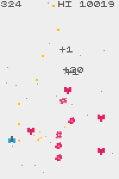

Step 07 conclusion: [deployment](https://junongx.github.io/crisp-game-lib-tutorial/?step_07) / [code](https://raw.githubusercontent.com/JunoNgx/crisp-game-lib-tutorial/master/docs/step_07/main.js).

## Step 08: Extra goodies

While this is all great and nice, I'd like to give you an even cooler version of the game.

### Step 081: Replay

```javascript
options = {
    isReplayEnabled: true
}
```

By enabling an option with this one single line, the title screen will now automatically replay your last session. Your game is now 10x cooler without you having to do anything.

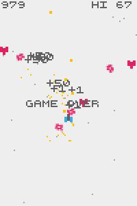

### Step 082: Themes

Excerpt from documentation:
```javascript
//   theme?: "simple" | "pixel" | "shape" | "shapeDark" | "crt" | "dark";
//    // Select the appearance theme.
```

By adding another option `theme`, you'll get access to a set of filters that pretty much transforms your game visually.

```javascript
options = {
    theme: "dark"
}
```
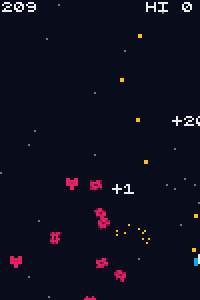
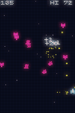

However, it should be strongly emphasized that this is **not an option to be used recklessly**. `simple` and `dark` are the only two guaranteed safe options. Everything else is extremely resource hungry, and not all games are suitable for these themes (like this, for example). You are not going to have a very good performance or experience otherwise.

This goes doubly so, if you have any intention of using the next feature.

### Step 083: GIF capturing

While LiceCap is always there, it is pretty cool to have a built-in tool to natively record gameplay gifs.

```javascript
options = {
    isCapturing: true,
    isCapturingGameCanvasOnly: true,
    captureCanvasScale: 2
}
```
With at least the first option enabled, pressing the key `C` on your keyboard while running the game will record the last 5 seconds of footage, which will then be inserted into the HTML page the game is running on. You can then retrieve the gif file from there.

By enabling the first option only, you'll get a relatively small GIF with horizontal margins which is optimized for sharing on Twitter. 

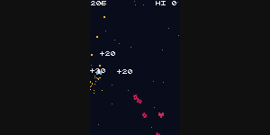

Enabling `isCapturingGameCanvasOnly` will allow you to capture only the game canvas, in which case, you can use the third option `captureCanvasScale` to adjust the output size. This is also how I have been recording gifs for this tutorial.

Needless to say, the smaller the output, the faster it works. It should also be noted that any theme that isn't `simple` and `dark` is not going to play very well with these two options, on top of their potential performance issue.

So there you are, congratulations. Hopefully you have now acquired a good amount of knowledge of CrispGameLib and ready take on your own ideas.

Step 08 conclusion: [deployment](https://junongx.github.io/crisp-game-lib-tutorial/?step_08) / [code](https://raw.githubusercontent.com/JunoNgx/crisp-game-lib-tutorial/master/docs/step_08/main.js).

# Game Distribution

The most simple way to distribute your games made with CrispGameLib is using GitHub Page.

If you already have a forked repository of CrispGameLib:
* Access the Settings/Pages for the forked repository.
* Choose the appropriate branch (most likely `master`) and change the source folder to `/docs` from the dropdown menu.
* Access the game at `https://<your-username>.github.io/<repository-name>/?<game-folder-name>`.

At this point, you may simply make a copy of `_template`, rename it, and start working on your own games. Your new commits and changes, once pushed to remote, will be instantly reflected on your GitHub Page. Do create branches if you have need to.

Distributing the direct URLs is also a convenient way to let your audiences access your game.

# Community

Feel free to post your work to reddit in our community on Reddit at [r/CrispGameLib](https://www.reddit.com/r/CrispGameLib/) or hashtag your Twitter post with #CrispGameLib.

# Feedback and Critique

Feedback, questions, suggestions, and contribution are highly welcomed. Feel free to reach me in anyway you can, though the most direct way would be opening an issue for this repository.
